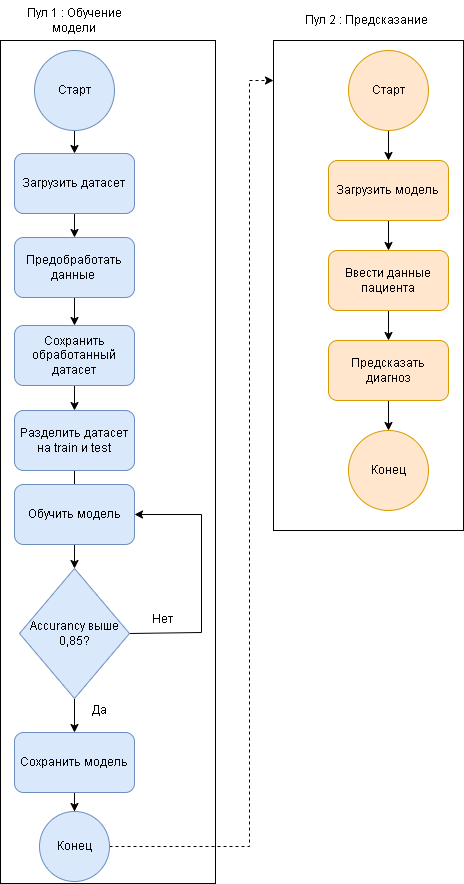

# Disease Prediction

Предсказание диагноза по симптомам и физиологическим показателям пациента
с помощью логистической регрессии.

## Установка

```bash
git clone <url>
cd <project>
uv sync
```

## Обучение модели

```bash
uv run python -m src.avto_mo.train
```

Скрипт:

- загружает data/raw/disease_diagnosis.csv,

- выполняет предобработку (One-Hot симптомов, разбор давления, кодирование пола),

- обучает логистическую регрессию,

- сохраняет модель в models/disease_model.pkl,

- выводит accuracy и classification report.

## Предсказание диагноза

```bash
uv run python -m src.avto_mo.predict
```

## BPMN схема

